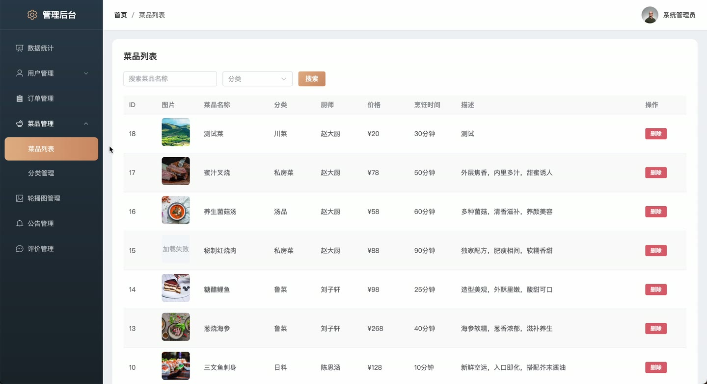
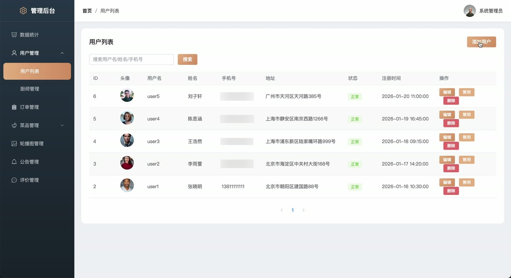

# (附文档)Springboot3+Vue3+MySQL 私房菜上门预约服务系统

**技术栈**：Springboot3、Vue3、MySQL

### 系统简介

本系统是一个基于 Spring Boot 3 + Vue 3 + MySQL 的私房菜上门预约服务系统，采用前后端分离架构。系统包含普通用户端、教练端（厨师端）和管理员端三个角色，支持用户浏览厨师、预约服务、在线支付、评价反馈，厨师管理菜品与排期，管理员进行全局运营管理。
 
### 核心功能
 
### 普通用户端

 
- 注册与登录：支持用户注册新账户，并选择角色（普通用户/厨师）进行登录，系统自动签发 JWT Token。 
- 首页浏览：查看首页轮播图（Banner）、公告列表、菜品分类列表。 
- 厨师列表：按擅长菜系、服务区域、关键字搜索厨师，并查看厨师详细信息（评分、订单数、简介）。 
- 厨师详情：查看厨师个人资料、菜品列表、历史评价、可用排期（按日期筛选）。 
- 收藏厨师：对心仪的厨师进行收藏/取消收藏，并在收藏列表查看已收藏的厨师。 
- 浏览记录：系统自动记录用户对厨师的浏览行为，用于后续推荐。 
- 智能推荐：基于协同过滤算法，根据浏览历史推荐相似厨师，若无历史则推荐热门厨师。 
- 创建预约订单：选择厨师、服务日期与时段、服务地址、联系人信息、宾客人数、特殊要求，并勾选菜品及数量，提交订单。 
- 订单管理：查看我的订单列表（支持按状态筛选），可取消订单（填写取消原因），可对已完成订单进行支付（模拟支付，选择支付方式）。 
- 评价订单：对已完成的订单进行评价，填写服务评分、菜品评分和评价内容。 
- 个人中心：查看和编辑个人信息（头像、昵称、手机号等），修改登录密码。 
- 公告详情：点击公告标题查看公告完整内容。
 
### 教练端（厨师端）

 
- 登录入口：通过独立路径 /chef-admin/login 进入厨师后台，使用厨师账号登录。 
- 仪表盘：查看个人订单统计概览（待确认、待服务、已完成、已取消数量）。 
- 菜品管理：管理个人私房菜，支持添加菜品（名称、分类、价格、图片、描述、食材、烹饪时长）、编辑、删除，可按分类和关键字搜索。 
- 排期管理：设置个人可服务日期与时段，支持批量添加（选择日期和多个时段），也可单独添加或删除排期，修改排期状态。 
- 订单管理：查看收到的预约订单列表（支持按状态筛选），可确认或拒绝订单，订单完成后可标记为已完成。 
- 评价管理：查看用户对自己的评价列表，并可回复评价内容。 
- 个人中心：查看和编辑个人资料，修改登录密码。
 
### 管理员端

 
- 登录入口：通过独立路径 /admin/login 进入管理后台，使用管理员账号登录。 
- 仪表盘：查看平台运营数据总览，包括订单总数、已完成订单数、待确认订单数、已取消订单数、总用户数、活跃厨师数、总交易金额。 
- 订单趋势：查看近 7 天每日订单量趋势图。 
- 分类统计：查看厨师擅长菜系分布统计。 
- 用户管理：查看所有用户列表（支持按角色、状态、关键字搜索），可添加用户、编辑用户信息、启用/禁用用户、删除用户。 
- 厨师审核：对注册为厨师的用户进行审核，通过或驳回申请。 
- 菜品分类管理：管理菜品分类，支持添加（名称、排序）、编辑、删除，分类名称不可重复。 
- 轮播图管理：管理首页轮播图，支持添加（标题、图片、链接、排序、状态）、编辑、删除。 
- 公告管理：管理平台公告，支持添加（标题、内容、类型、状态）、编辑、删除，可按类型和关键字搜索。 
- 订单管理：查看所有订单列表（支持按状态、订单号/联系人搜索），查看订单详情（含菜品明细和评价）。 
- 评价管理：查看所有用户评价列表，可删除不当评价。 
- 文件上传：支持上传图片文件，返回可访问的 URL 地址。
 
### 技术栈

  后端框架 Spring Boot 3.x   ORM MyBatis-Plus   权限认证 JWT（jjwt）   前端框架 Vue 3   状态管理 Pinia   构建工具 Vite   数据库 MySQL 8.x   工具库 Hutool、Lombok 
 
### 交付内容

 
- 后端完整源码 
- 前端完整源码 
- 数据库初始化脚本 
- 万字文档

## 界面展示

---

## 获取完整源码 + 万字文档

本仓库为项目介绍页。**完整前后端源码、数据库初始化脚本、万字项目文档**，请加微信 `kangkangcode`，或访问 [codekk.top](http://codekk.top) 获取。

可作课程设计 / 毕业设计参考，支持远程部署调试。